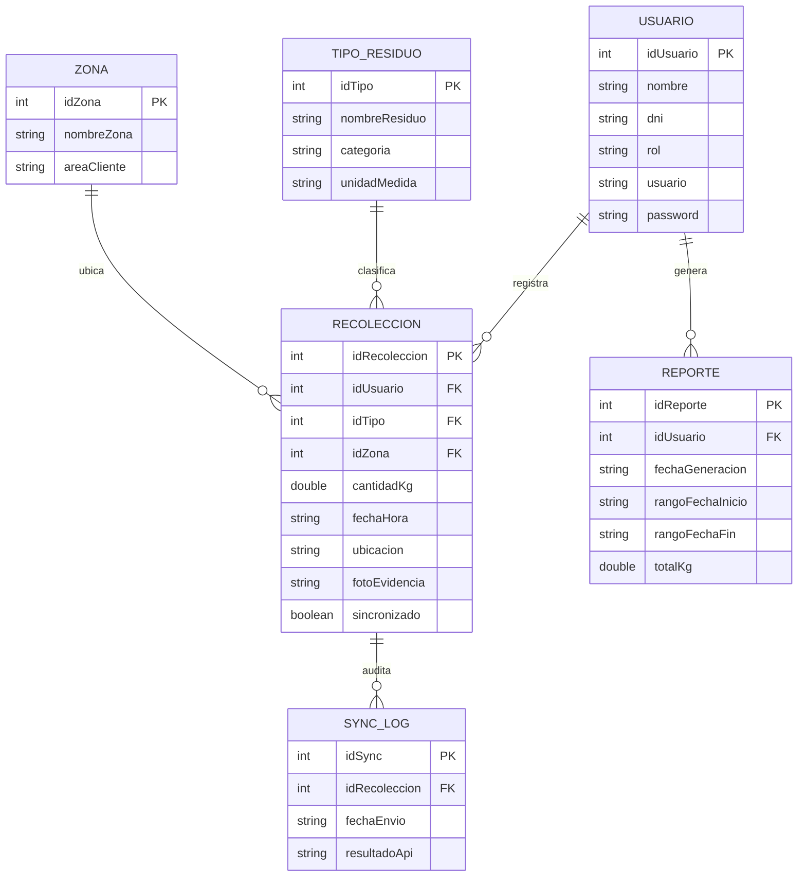

# ECOLIM S.A.C. — Aplicación Móvil Android

Sistema móvil para la digitalización y trazabilidad del registro de recolección de residuos sólidos en servicios de limpieza industrial, desarrollado para **ECOLIM S.A.C.** conforme al Trabajo Final de **SENATI**.

---

## 1. Contexto y Objetivos

La empresa **ECOLIM S.A.C.** sustituye el registro manual en papel y planillas por una solución móvil Android con:
- **Registro rápido de recolecciones**: Tipo de residuo, cantidad en kilogramos, zona/área, fecha y hora automática, geolocalización y foto o código de contenedor.
- **Arquitectura Offline-First**: Almacenamiento local prioritario en SQLite mediante Room para operaciones en entornos industriales sin cobertura de red.
- **Sincronización Automática y Bajo Demanda**: Sincronización en segundo plano con WorkManager cuando existe conexión, y botón manual "Sincronizar Ahora".
- **Reportes y Filtros Avanzados**: Filtrado por rangos de fecha y tipo de residuo con totales acumulados y opción de exportar/compartir vía Intent.

---

## 2. Stack Tecnológico

| Componente | Tecnología |
|---|---|
| **Lenguaje** | Java 17 |
| **Arquitectura** | MVVM (Model - View - ViewModel) con separación estricta en capas |
| **Persistencia Local** | Room Database 2.6.1 (SQLite) |
| **Red y API REST** | Retrofit 2.11.0 + OkHttp 4.12.0 + Gson |
| **Segundo Plano / Sync** | WorkManager 2.9.1 (Offline-First) |
| **Cámara y Escaneo** | CameraX 1.3.4 + Google ML Kit Barcode Scanning |
| **Interfaz de Usuario** | XML Layouts + Google Material Design 3 (con contraste alto y targets >= 48dp) |
| **Build System** | Gradle 8.13 + Android Gradle Plugin 8.7.3 |
| **Pruebas** | JUnit 4 + AndroidX Test Runner + Room In-Memory Testing |

---

## 3. Arquitectura y Estructura del Proyecto

```
c:\ECOLIM\
 ├── app/
 │    ├── build.gradle
 │    └── src/
 │         ├── main/
 │         │    ├── AndroidManifest.xml
 │         │    ├── java/com/ecolim/app/
 │         │    │    ├── EcolimApplication.java
 │         │    │    ├── ui/
 │         │    │    │    ├── LoginActivity.java           (Pantalla 1: Login)
 │         │    │    │    ├── MainActivity.java            (Contenedor navegación)
 │         │    │    │    ├── fragments/
 │         │    │    │    │    ├── RegistroFragment.java   (Pantalla 2: Registro)
 │         │    │    │    │    ├── HistorialFragment.java  (Lista con badges sync)
 │         │    │    │    │    └── ReportesFragment.java   (Pantalla 3: Reportes)
 │         │    │    │    └── adapters/
 │         │    │    │         ├── RecoleccionAdapter.java
 │         │    │    │         └── ReporteResumenAdapter.java
 │         │    │    ├── viewmodel/
 │         │    │    │    ├── RegistroViewModel.java
 │         │    │    │    └── ReportesViewModel.java
 │         │    │    ├── data/
 │         │    │    │    ├── local/
 │         │    │    │    │    ├── AppDatabase.java      (Room Database Singleton)
 │         │    │    │    │    ├── entities/             (Usuario, TipoResiduo, Zona, Recoleccion, Reporte, SyncLog)
 │         │    │    │    │    └── dao/                  (UsuarioDao, RecoleccionDao, ReporteDao, ...)
 │         │    │    │    ├── remote/
 │         │    │    │    │    ├── ApiService.java       (Retrofit Endpoints)
 │         │    │    │    │    ├── RetrofitClient.java
 │         │    │    │    │    └── dto/                  (RecoleccionDTO, LoginDTO, ...)
 │         │    │    │    └── sync/
 │         │    │    │         └── SyncWorker.java       (WorkManager Background Sync)
 │         │    │    ├── repository/
 │         │    │    │    └── RecoleccionRepository.java (Fuente única de verdad)
 │         │    │    └── utils/                          (DateUtils, SecurityUtils, Constants, SessionManager)
 │         │    └── res/
 │         │         ├── layout/                       (activity_login.xml, fragment_registro.xml, fragment_reportes.xml, ...)
 │         │         ├── values/                       (colors.xml, strings.xml, themes.xml, dimens.xml)
 │         │         └── drawable/                     (botones, logo circular ECOLIM, bordes punteados)
 │         └── test/                                   (SecurityUtilsTest, DateUtilsTest, DatabaseEntitiesTest)
 ├── server/
 │    ├── mock-server.js                               (Servidor Node.js REST API)
 │    └── package.json
 ├── build.gradle
 ├── settings.gradle
 ├── gradlew / gradlew.bat
 └── PRIVACY.md
```

---

## 4. Modelo Entidad - Relación (Room / SQLite)



---

## 5. Wireframes y Diseño Implementado

### Pantalla 1: Login
- Cabecera azul: `"ECOLIM - Iniciar sesión"`
- Logotipo central circular con borde azul y branding ecológico.
- Campos redondeados: `"Usuario / DNI"` y `"Contraseña"`.
- Botón verde de alto contraste: `INGRESAR`.
- Checkbox: `"Recordar sesión"`.

### Pantalla 2: Registro de Residuo
- Cabecera azul: `"Registrar Residuo"`.
- Selector desplegable: `"Tipo de residuo ▼"`.
- Entrada decimal: `"Cantidad (kg)"`.
- Selector desplegable: `"Zona / Área ▼"`.
- Botón con borde punteado: `"[Cam] Escanear código / Foto"`.
- Campo automático de auditoría: `"Fecha y hora (auto)"`.
- Botón verde: `"GUARDAR REGISTRO"` (guarda localmente en Room).
- Botón azul: `"SINCRONIZAR AHORA"` (sincroniza registros pendientes con la API).

### Pantalla 3: Reportes
- Cabecera azul: `"Reportes"`.
- Selectores con calendario: `"Desde: 01/09/2026"` y `"Hasta: 12/09/2026"`.
- Filtro por tipo: `"Tipo de residuo ▼ (todos)"`.
- Botón azul: `"FILTRAR"`.
- Resumen consolidado:
  - Papel/cartón: 120 kg
  - Plástico: 85 kg
  - Orgánico: 210 kg
  - Total consolidado en el período.
- Botón naranja: `"EXPORTAR / COMPARTIR"` (permite compartir el balance por WhatsApp, Correo, etc.).

---

## 6. Credenciales de Prueba (Demo)

| Rol | Usuario / DNI | Contraseña |
|---|---|---|
| **Operario** | `operario` (o DNI `72345678`) | `123456` |
| **Supervisor** | `supervisor` (o DNI `45678912`) | `admin123` |

*Las contraseñas se almacenan internamente hasheadas con SHA-256.*

---

## 7. Instrucciones de Compilación y Ejecución

### Requisitos Previos
- Java Development Kit (JDK) 17 o superior.
- Android SDK instalado (API 34 o 35).
- Node.js (opcional, para ejecutar el mock server).

### Compilar el APK de Depuración
```bash
./gradlew assembleDebug
```
El archivo APK resultante se generará en:
`app/build/outputs/apk/debug/app-debug.apk`

### Ejecutar Pruebas Unitarias
```bash
./gradlew test
```

### Iniciar el Servidor Mock REST API (Opcional)
En una terminal independiente:
```bash
node server/mock-server.js
```
El servidor responderá en `http://localhost:3000` con los endpoints:
- `POST /api/auth/login`
- `POST /api/recolecciones`
- `GET /api/reportes`

---

## 8. Permisos Declarados en AndroidManifest

| Permiso | Justificación Técnica y de Privacidad |
|---|---|
| `INTERNET` | Para la sincronización de recolecciones con el servidor REST. |
| `ACCESS_NETWORK_STATE` | Para detectar si el dispositivo cuenta con conexión antes de intentar sincronizar. |
| `CAMERA` | Para capturar fotos de evidencia y escanear códigos de barras de los contenedores. |
| `ACCESS_FINE_LOCATION` | Para registrar la coordenada GPS exacta del punto de recolección industrial. |

Consulte [PRIVACY.md](PRIVACY.md) para más información sobre la política de protección de datos.
